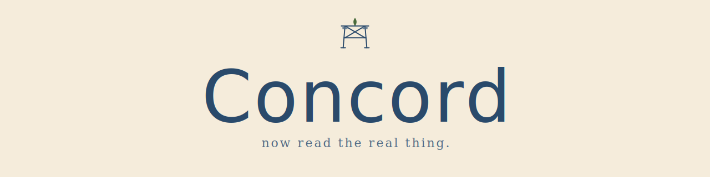

# concord-tutorial-react

You finished the first course, built a real app, and felt good about it. Then you opened a "real"
React project — maybe [songbird](https://github.com/kbennett2000/songbird) — to see how the pros
do it, and the floor dropped out. Folders of files, words you'd never seen, nothing that looked
like what you'd just written.

That feeling is exactly why this course exists.

There's no cliff here — just a short set of steps. Five lessons, **one new idea each**, rebuilding
the app you already know. By the last one you'll open that "real" project again and recognize it:
*your* code, grown up. Because the point isn't React. The point is you, reading real code.

## Who this is for

You did [the first course](https://github.com/kbennett2000/concord-tutorial-web) — or you can
already fetch from Concord and put the results on a page in plain HTML and JavaScript. You have
**not** touched React, and that's the whole point: we start there together.

> **Already write React?** You're welcome to skim, but this is a "your first React app" course,
> written gently and on purpose. For a fast reference, Concord's
> [`docs/API.md`](https://github.com/kbennett2000/concord/blob/main/docs/API.md) and songbird's
> source are right there.

## Before you start

> **Concord needs to be running** — the same Scripture engine from the first course. Check it in
> 30 seconds by opening this in your browser:
>
> ```
> http://localhost:8000/healthz
> ```
>
> You're ready when a short line of data comes back — a few counts (translations, verses, places),
> not a styled page. Nothing there? Concord's
> [Quick start](https://github.com/kbennett2000/concord#quick-start) gets it running.

If you ran Concord for the first course, **grab the current version before you begin** — this
course uses a newer feature, and the Quick start above always pulls the latest. (Starting fresh?
You'll get the right one automatically.)

Lesson 1 is already a page you run — it loads React — so you'll do the same quick local-preview
setup you used in the first course. A couple of minutes, once. See [SETUP.md](SETUP.md).

## Start here

Open [Lesson 1](lessons/01-the-same-verse/). It's the verse you fetched in the first course, rebuilt
the React way — and it's a short one.

What's ahead, one small win at a time: the same verse the new way, a search that updates as you
type, your own reusable building blocks, verses that link to other verses — and then the lesson
that's really the point: opening a real app and finding you can read it.

## License

MIT © 2026 Kris Bennett — see [`LICENSE`](LICENSE). (Parity with Concord and the first course.)
