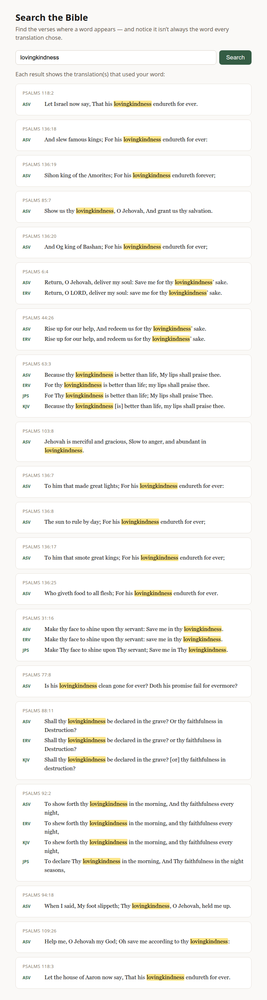

# Lesson 2 — Type, and watch it change

Last lesson, your verse showed up once and sat there. Real apps *respond* — you type, and the page
answers. This lesson builds a Bible search: type a word, and the verses that use it appear. Change
the word, search again, and the results swap themselves out.

That swap is the whole point. In your first course, updating the page meant clearing the old stuff
and rebuilding by hand. Here you won't write a single line to clear anything — and that's the one
new idea you're here for: **state**.

## See it work first

1. Open this lesson's folder, `lessons/02-type-and-watch/`, in VS Code and click **Go Live** (or
   `python3 -m http.server 5500` from the folder). *(Need the setup again? It's in
   [SETUP.md](../../SETUP.md).)*
2. The search box opens already filled with **lovingkindness**. Click **Search**.
3. A list of verses appears — and each one shows *which translation* used that word, with the word
   highlighted.



Now try this: clear the box, type **shepherd**, and search again. The old results vanish and the new
ones take their place. **You never told them to.** Let's see how.

## How it works

It's the same three tools from Lesson 1, and the same kind of components. The new piece is one line:

```jsx
const { useState } = React;
```

### State: what a component remembers

A plain variable resets every time React redraws. **State** is a value React *remembers* between
redraws — and changing it tells React to redraw. You make one with `useState`:

```jsx
const [query, setQuery] = useState("lovingkindness");
```

That reads as: "keep a piece of state called `query`, starting at `"lovingkindness"`, and give me
`setQuery` to change it." This app keeps three such pieces — what's in the box (`query`), the verses
found (`hits`), and a little `status` for the messages — each made the exact same way.

### The one shift from last lesson

In Lesson 1 you fetched a verse and then called `render` to draw it. Look at the bottom of this
file:

```jsx
ReactDOM.createRoot(document.getElementById("root")).render(<App />);
```

You call `render` **once**, ever. After that you never call it again. Instead you change
state — `setHits(...)`, `setQuery(...)` — and React redraws the page for you. *That* is what
replaces all the by-hand DOM updates from your first course.

### Typing into state

The search box is wired straight to state:

```jsx
<input value={query} onChange={(event) => setQuery(event.target.value)} />
```

`value={query}` means the box always shows what's in `query`. `onChange` runs on every keystroke and
calls `setQuery`, which updates the state, which redraws — so the box shows what you typed. The box's
contents *are* state.

### Searching, when you submit

When you press Search (or Enter), one function runs: it asks Concord for the word, then drops the
results into state.

```jsx
const data = await response.json();
setHits(data.hits);   // ← replace the results; React redraws
```

The fetch itself is the familiar part from your first course. The `translations=*` on the end means
"search **every** translation at once" — that's the new thing Concord can do, and it's why each
result can show more than one translation.

### The honest part: who actually used the word

Here's a detail worth slowing down for. Search **lovingkindness** and look at Psalm 118:2 — the
result lists only **ASV**. Why just one? Because where the ASV says *"his lovingkindness endures
forever,"* the King James says *"his **mercy** endures forever."* Same verse, different word — so the
King James simply isn't in that result.

That's exactly how Concord answers: each result's `matches` holds **only the translations whose text
contains your word** — not all of them. So we render straight from `matches`:

```jsx
const translations = Object.keys(hit.matches);   // only the ones that used the word
```

Your app isn't claiming "here's this verse in 13 translations." It's answering a sharper, truer
question: *who reached for this word, here?* (The full side-by-side — every translation of a verse,
lined up — is the next lesson.)

> The highlighting is handled by a small helper named `markSegments` near the top of the file. It
> splits Concord's snippet on the `<mark>` tags so we can show the matched word in yellow — as plain
> text, never as raw HTML. You don't need to read it; songbird has the very same helper, grown up, in
> `highlight.ts`. (And like every lesson, the `CONCORD` line at the top is the only thing to change
> if Concord runs elsewhere.)

## You can now…

…hold changing data in **state**, and let React redraw the page whenever that state changes — no
clearing, no rebuilding by hand. You typed, you searched, the results replaced themselves.

This is the thing React is *for*. Everything else in a React app is built on the move you just
made. You felt it.

**Next:** you wrote that little result block once. What if you could stamp it out as many times as
you like, each with different data? That's a *component you reuse* — and it's how songbird is built.
→ [Lesson 3](../03-build-once/)
