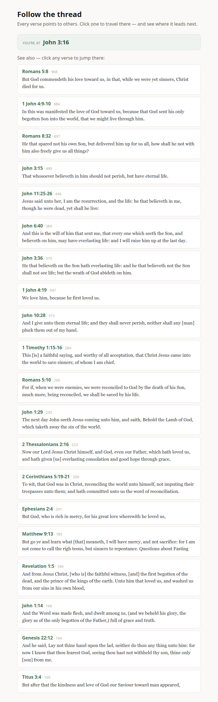
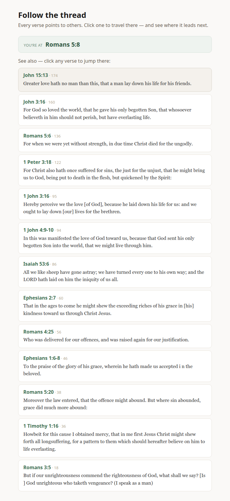

# Lesson 4 — Follow the thread

You can show a verse now — even three at once. But verses don't stand alone. Each one points to
others: *see also Romans 5:8… see also 1 John 4:19…* — the connections scholars have drawn across
the whole Bible. This lesson puts those on screen and lets the reader **click to travel** from verse
to verse.

The new idea is small but it's the one real apps lean on hardest: **fetching in response to what the
reader does.** A click, and your app goes and gets something new.

## See it work first

1. Open this lesson's folder, `lessons/04-follow-the-thread/`, in VS Code and click **Go Live** (or
   `python3 -m http.server 5500` from the folder). *(Setup is in [SETUP.md](../../SETUP.md).)*
2. The page opens already showing **John 3:16** and the verses it points to.
3. Click one — **Romans 5:8** sits right at the top. You jump there, and now you're looking at
   *Romans 5:8's* cross-references.



Keep clicking. You can wander all the way across Scripture, one connection at a time, never typing a
thing. Let's see how a click makes that happen.

## How it works

The state and the components are the tools you already have. Two pieces are worth a look — one new,
one nearly new.

### Fetching when the reader clicks

Here's the heart of it. Each cross-reference is a button, and clicking it runs one function:

```jsx
<button className="xref" onClick={() => goTo(entry.to.reference)}>
```

```jsx
async function goTo(ref) {
  const response = await fetch(`${CONCORD}/v1/cross-references/${encodeURIComponent(ref)}?include_text=true&limit=20`);
  const data = await response.json();
  setReference(ref);
  setCrossRefs(data.cross_references);   // ← new data into state; React redraws
}
```

That's the whole idea: a click runs `goTo`, `goTo` fetches the new verse's cross-references, and the
results go into state — so the page redraws around them. **An event, a fetch, then state.** It's how
nearly everything interactive in a real app works.



### What Concord sends back

We ask the `/v1/cross-references/` endpoint with `include_text=true` so each connection arrives with
a little of the target verse's text. Each one looks like this, and we read three fields:

```jsx
entry.to.reference   // where it points, e.g. "Romans 5:8"
entry.text           // a snippet of that verse
entry.votes          // how many people found the link meaningful
```

They come back ordered by those votes, strongest first — which is why Romans 5:8 leads the list for
John 3:16.

### The one thing that happens on load

Every fetch so far waited for *you* — a click, a Search button. But this page shows a verse the
moment it opens, before you've touched anything. That's the one job for **`useEffect`**:

```jsx
useEffect(() => {
  goTo("John 3:16");
}, []);
```

`useEffect` runs code in response to the page itself — and that empty `[]` at the end means *run
once, when the page first appears.* Here it loads the starting verse so there's something to see and
click right away. That's the only time this course reaches for it; everything else is driven by what
the reader does.

> As always, the `CONCORD` line at the top is the only thing to change if Concord runs on another
> computer.

## You can now…

…fetch in response to a click, drop the result into state, and let React redraw — and do one thing
the moment the page loads. The reader clicks, your app travels, the screen follows.

You just built the **cross-reference panel songbird ships**. When you open songbird in the next
lesson, look at `frontend/src/components/CrossReferences.tsx` — a list of cross-references, each one
clickable, jumping you to the verse. You'll recognize every part of it, because you just wrote it.

**Next:** the last step. You've built four real things with React — now we meet the tools the pros
wrap around it, fix that little startup blink for good, and open songbird itself to find you can read
it. → [Lesson 5](../05-the-real-thing/)
